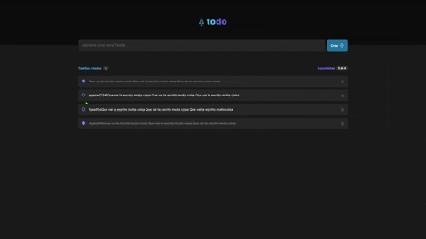
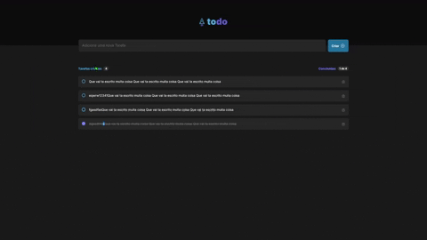

# ToDo List - ReactJS

I think that everyones that are starting to coding with JS, TS and ReactJS needs to do something similar. It's easy and work pretty much all the fundamentals.

This is a challenge from the new modules on Ignite - ReactJS.

## Some app images

  

  

